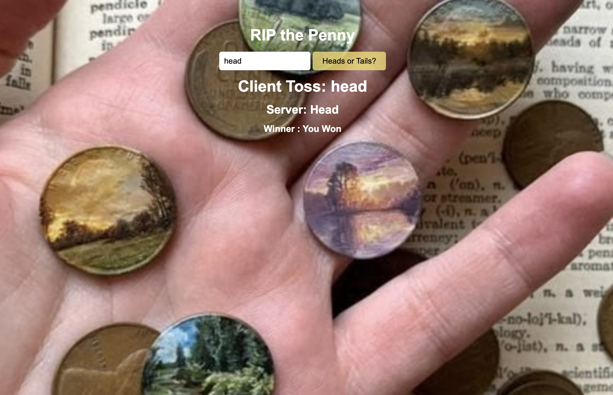

# RIP the Penny (Coin Flip)🪙

A coin flip game where you guess heads or tails and the server flips the coin to see if you win.

## Description

This is a coin flip game I made to practice server side JavaScript. You type in "Head" or "Tail" and click the button. Your guess gets sent to a Node server, the server flips a coin at random, and it sends back the result and whether you won or lost. I built it to practice making my own server with Node.js and using `fetch` to talk to it.

## Screenshot

<!-- Add a screenshot: Cmd + Shift + 4 on Mac, save it in assets/images/, then update the file name below -->

## Features

- Type in your guess and click the button to flip the coin
- The server flips the coin at random
- Tells you what you guessed, what the server got, and if you won or lost
- Accepts "head", "heads", "tail" or "tails" in any mix of capital and lowercase letters
- Any other guess counts as a loss
- Custom Node server that serves the pages and the API

## Tech Used

- HTML
- CSS
- JavaScript
- Node.js

## How to Use

This app needs a Node server

1. Start the server:
2. Open your browser and go to localhost:8000
3. Type **Head** or **Tail** in the box.
4. Click **Heads or Tails?** to see if you won.
5. To stop the server, press Ctrl + C in the terminal.

## How It Works

1. When you click the button, main.js grabs what you typed.
2. It sends your guess to the server
3. The server sends back the result and whether you won, and the page shows it.

## What I Learned

- How to make a basic server with Node.js
- How to send data to the server using query parameters
- How to send back JSON from the server

## Author

Maya Rose — [GitHub](https://github.com/Mayaerose) 🌹
